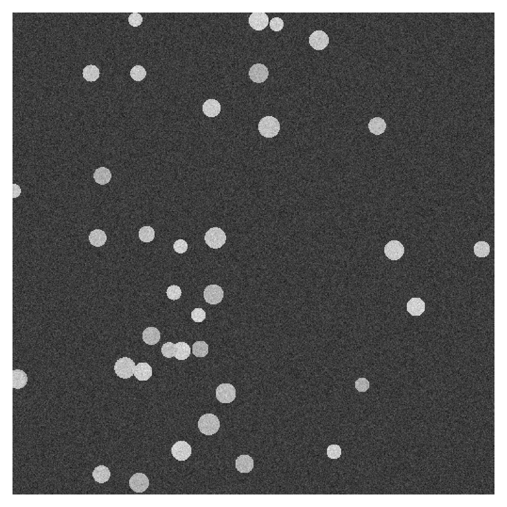
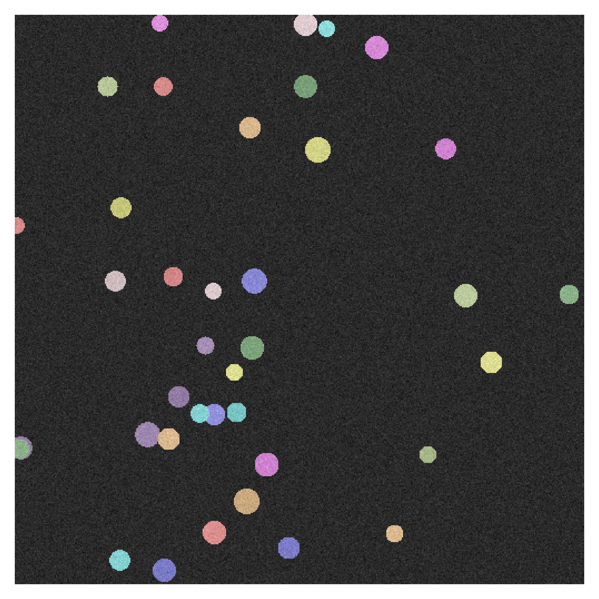

# Instance Segmentation

TensorFlow instance segmentation based on learned embeddings.

## The Example Data Set

To have a simple data set at hand, we create a bunch of bright circles (with slightly varying gray-value) on a dark background and add some noise to it to complicate the segmentation task a bit. Even a simple model should have the chance to fit to that data.

| input data                             | labels                                      |
| :--- | :--- |
|  |  |

You can explore the data set via the following command which will create three example images, like the above.

```bash
poetry run python ./scripts/inspect_circle_data.py --export-path=.validation_output
```

## Training an Embedding Model

The repository comes with a very simple encoder-decoder-model. If you just like to train a model to see quickly see some results, you can use the following command:

```bash
poetry run python ./scripts/train_embedding_model.py .model .report --number-of-iterations=2500
```

If you would like to use the loss function with your own model, it is as simple as:

```python
from instancesegmentation.loss.metricloss import MetricLoss

embedding_loss = MetricLoss()
# ...
embedding_loss_value = embedding_loss(predicted_embeddings, instance_labels)
```

### Options

You can change the behavior of the loss function via the following parameters:

| Parameter | Influence | Default |
| :--- | :--- | :--- |
| push_distance_metric | Defines the distance or similarity metric applied to push appart the clsuter centroids. | `instancesegmentation.loss.distancemetric.ManhattanDistanceMetric` |
| pull_distance_metric | Defines the distance or similarity metric applied to pull together the members of a cluster. | `instancesegmentation.loss.distancemetric.ManhattanDistanceMetric` |
| push_error_metric | Converts the mean distance to an error metric. | `instancesegmentation.loss.errormetric.SquaredErrorMetric` |
| pull_error_metric | Converts the mean distance to an error metric. | `instancesegmentation.loss.errormetric.SquaredErrorMetric` |
| push_margin | Cluster centroids that are already farther apart than the push margin are not penalized. | 0.25 |
| pull_margin | Members of a cluster that are already closer to their centroid than the pull margin are not penalized. | 0.0 |
| push_weight | The weight of the push error in the total loss. | 1.0 |
| pull_weight | The weight of the pull error in the total loss. | 1.0 |
| regularization_error_metric | Prevent the clsuter centroids from drifting to infinity by applying a regularization loss. | `instancesegmentation.loss.errormetric.SquaredErrorMetric` |
| regularization_weight | The weight of the regularization error in the total loss. | 1e-4 |

## Predict on Unseen Data

Once the model is trained you can predict on some random data from the example data set using the test script.

```bash
poetry run python ./scripts/test_instance_segmentation.py .model --output-path=.validation_output
```

The learned embeddings of this model can for example look like this:


Clustering these embeddings will then yield the desired instance segmentation. To emphasize local proximity a bit it is possible to add some position encoding to the learned embeddings.
